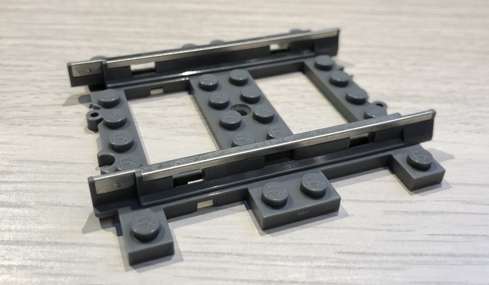

# Fx Bricks CAD Pipeline Notes

Fx Bricks designs and fabricates products which are designed to be compatible with the LEGO® System grid.  These products include electronic controllers and train system elements such as track, wheels, and other accessories.  These products are predominantly manufactured using injection molded ABS plastic.  Products such as train track, also incorporate stamped metal components with the plastic.

From the beginning, our aim was to use a CAD pipeline which was automated, repeatable, and parametric.  This ruled out traditional "hand drawn" CAD models since it would require a great deal of repetitive and tedious workflows as well as being vulnerable to errors due to operator fatigue and inevitable slips of the mouse.

In searching for a suitable CAD pipeline, we discovered [CadQuery](https://github.com/CadQuery/cadquery/), a python module designed to build parametric 3D CAD models.  Since CadQuery is based on python, it allows us to develop a very capable scripted software stack to build our 3D models and produce all of the various asset files used for design, prototyping, documentation and manufacturing.

With CadQuery, we build a component model and use variants of the model to make our production assets:

## CAD Model Structure

The diagram below shows the overall architecture of our CAD pipeline.  The core component is our  extensive collection of python source code modules which make up our CAD Model Generator.  This generator almost exclusively interacts with the [CadQuery API](https://cadquery.readthedocs.io/en/latest/) for building CAD primitives and eventually compositing more complex final component assemblies.

CadQuery itself uses the [OpenCascade](https://www.opencascade.com/content/overview) CAD kernel indirectly through the [python-occ](https://github.com/tpaviot/pythonocc-core) module (OCC) which provides python bindings for OpenCascade's C++ API.  OCC performs all of the low level construction of solids based on a hierarchy of geometric entities starting with edges, progressing to wires, faces and eventually enclosed solids.  CadQuery abstracts the complexity of building shapes and solids with a simple to use "fluid" API which efficiently chains together a series of operations into a single logical line of python code.

Our CAD Model Generator does interact with the OCC core directly for specialized tasks such as file import/export, meshing, and low-level geometric algorithms such tangent and intersection computation.  However, the overwhelming interaction is with the CadQuery API directly.

The output of our CAD pipeline is a variety of different assets files aimed at particular tasks.  These include:

- **STL** mesh files - used for 3D printed prototype components and eventually for high quality rendered animations using Blender
- **STEP** files - these are the primary manufacturing files used for plastic injection molding and progressive stamping. STEP files are also used for viewing and validation with [FreeCAD](https://www.freecadweb.org)
- [**LDraw**](https://www.ldraw.org) files - the LEGO® fan community has developed a range of software tools and applications based on the [LDraw specification](https://www.ldraw.org/article/218.html) for describing parts.  We use LDraw files to author custom instruction guides and to share with our users.
- **SVG** files - vector illustration format useful for making documentation

## Model Generator Process Flow

The diagram below shows the key steps our model generator uses to build our CAD models and associated assets.

Our CAD pipeline starts with a model specification.  This specification is either coded directly as a python dictionary or ingested into a dictionary from YAML files.  Either way, the specification provides a top level description of desired component to build.  The specification describes the basic geometry of the component as well as many other options and parameters such as draft angles, filleting, fidelity, etc.

### Intermediate Solid Generation

After validating the specification, the generator itemizes all of the sub-assembly and primitive level solids it requires to build the final model.  Some sub-assembly solids can involve a great deal of complexity and result in very long render times.  Therefore, instead of exhaustively generating these solids every time, it uses a "cache" of solids stored as STEP files on disk.  The management of the cache is automatic and greatly accelerates our iterative cycles in developing models.

### Model Compositing

When all of the intermediate component solids have been either generated or retrieved from the cache, the generator progressively merges these solids together programmatically.  These operations include:

- Translation/rotation - placement of one or more instances of intermediate solids into the required position and orientation in the final model
- Union - merging two or more shapes into one composite solid
- Cuts - removal and trimming of intermediate solids based on other solids, programmatic rules, or computed interferences

### Model Detailing

When a model has been composited into its final form, optional post processing can be performed.  These tasks include:

- Filleting - radiusing of edges based on design rules
- Text and logo application on the model (since these operations can be time consuming, they are usually left off until a final version of the model is required)
- Ad hoc modification of the model for experimental features and variants

### Asset Export

Primarily, the model generator exports STEP files which are then used to view and validate the model using tools such as FreeCAD.  However, if asset formats such as STL or LDraw are required, the model must be converted into a mesh representation instead of a geometric BRep representation.  Essentially this involves "digitizing" the solid with a triangular mesh shell.  This process is "lossy" in that curved faces are approximated by a series of triangular facets.  The OCC kernel uses an adpative algorithm to produce very good meshes which we then consume for STL and LDraw export.

## Conclusions

The development of our scripted CAD pipeline has proved to be  invaluable to both our productivity and agility in product development.  It reduces errors, provides a greater range of output assets and is capable of evolving easily with new capabilities and features.

One last point worth emphasizing is that a CAD pipeline based on source code benefits from the best practices of software development including version control in a repository, continuous testing, and collaboration in a team.

## Gallery

PFx Brick Model:

PFx Brick Pre-production Injection Molded Prototype:

R88 Curve Track Model:

R88 Curve Track 3D Printed Prototype:

R88 Curve Track Pre-production Injection Molded Prototype:

S8 Straight Track Model:

S8 Straight Track Pre-production Injection Molded Prototype:

